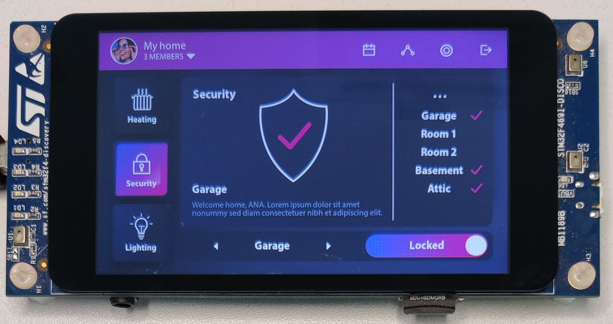

### Ownership and License

The contributors are listed in CONTRIB.TXT. This project uses the GPL v3 license, see LICENSE.TXT.
This project uses the [C4.1 (Collective Code Construction Contract)](http://rfc.zeromq.org/spec:22) process for contributions.
To report an issue, use the [issues page](https://github.com/eez-open/eez-flow-template-stm32f469i-disco/issues) tracker.

## Build

Get the source with:

```git clone --recurse-submodules https://github.com/eez-open/stm32f469i-disco-lvgl-demo```

#### Linux

```
sudo apt-get update
sudo apt-get install -y git libsdl2-dev libsdl2-image-dev libsdl2-ttf-dev cmake build-essential libbsd-dev
cd stm32f469i-disco-lvgl-demo
mkdir -p Src/build/linux
cd Src/build/linux
cmake ../..
make
```

Start simulator with:

```
./stm32f469i-disco-lvgl-demo
```


#### Windows

Install [Visual Studio Community 2017](https://visualstudio.microsoft.com/downloads/) and [CMake](https://cmake.org/install/).

Download and install SDL2 development libraries for Windows from https://www.libsdl.org/download-2.0.php. 

Download and install SDL2_Image development libraries for Windows from https://github.com/libsdl-org/SDL_image/releases.

Update these environment variables in `cmake.bat` according to the location (and version) where SDL2 and SDL2_Image has been installed:

```
set SDL2DIR=..\SDL2-2.0.14
set SDL2IMAGEDIR=..\SDL2_image-2.0.4
```

Execute `cmake.bat`:

```
cd stm32f469i-disco-lvgl-demo\Src
.\cmake.bat
```

Visual Studio solution is created in `stm32f469i-disco-lvgl-demo\Src\build\win32`.

Use Visual Studio to build the solution.

#### Emscripten

These instructions are for the Linux.

[Download and install Emscripten](https://emscripten.org/docs/getting_started/downloads.html)

```
source /path/to/emsdk/emsdk_env.sh
export EMSCRIPTEN=/path/to/emsdk/upstream/emscripten
mkdir -p stm32f469i-disco-lvgl-demo/Src/build/emscripten
cd stm32f469i-disco-lvgl-demo/Src/build/emscripten
cmake -DCMAKE_TOOLCHAIN_FILE=../../cmake/Emscripten.cmake -DCMAKE_BUILD_TYPE=Debug -G "Unix Makefiles" ../..
make
```
