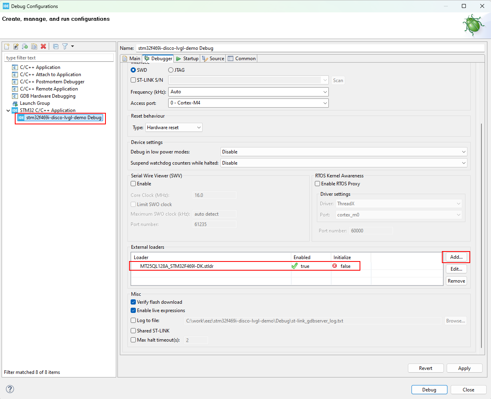

NEW! This example now works with the LVGL 9.3.0 dev version.

### Ownership and License

The contributors are listed in CONTRIB.TXT. This project uses the GPL v3 license, see LICENSE.TXT.
This project uses the [C4.1 (Collective Code Construction Contract)](http://rfc.zeromq.org/spec:22) process for contributions.
To report an issue, use the [issues page](https://github.com/eez-open/eez-flow-template-stm32f469i-disco/issues) tracker.

## Build

Get the source with:

```git clone --recurse-submodules https://github.com/eez-open/stm32f469i-disco-lvgl-demo```

Use [STM32CubeIDE](https://www.st.com/en/development-tools/stm32cubeide.html) to build.

**Important:** you need to use external loader while flashing because images and fonts are stored in the QSPI external flash. Here is how to add it in the STM32CubeIDE:



and here is how to add it in the STM32CubeProgrammer:


## Test

Use [Discovery kit with STM32F469NI MCU](https://www.st.com/en/evaluation-tools/32f469idiscovery.html) to test.